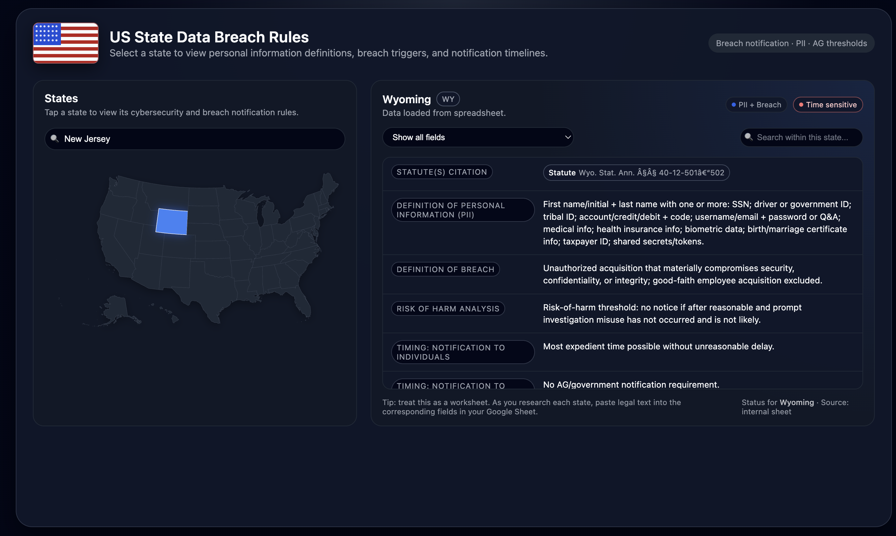

# US State Data Breach Atlas

A web-based visualization tool for exploring and comparing data breach notification statutes across the United States.



## Project Overview

This application aggregates complex state-specific legal requirements—including PII definitions, notification timelines, and penalty clauses—into a unified, searchable interface. It is designed to assist researchers and compliance officers in navigating the fragmented landscape of US data privacy laws.

Unlike static reference lists, this tool utilizes an interactive SVG map and allows for real-time filtering of specific legal provisions.

## Technical Architecture

The application is built as a serverless, client-side single-page application (SPA).

* **Frontend:** HTML5, CSS3 (using CSS Variables and Grid), and Vanilla JavaScript. No external UI frameworks were used to ensure minimal load times.
* **Data Storage:** Google Sheets (Published to Web) acts as a headless CMS, allowing for data updates without code redeployment.
* **Data Transport:** The application fetches a TSV stream via a CORS proxy (`corsproxy.io`) to handle cross-origin requests securely from the client side.
* **Visualization:** Custom SVG path manipulation for the interactive map interface.

## Features

* **Interactive Visualization:** Select states via an interactive map or search filter to load specific statutory data dynamically.
* **Live Data Connection:** The application parses remote TSV data on initialization, ensuring the content is always strictly synchronized with the source spreadsheet.
* **Advanced Filtering:** Users can filter requirements by category (e.g., Risk of Harm Analysis, Attorney General Notification) or search by keyword.
* **Responsive Layout:** The interface adapts layout and navigation for desktop and mobile viewports.

## Local Development

To run this project locally, clone the repository and serve it via a local web server.

1.  **Clone the repository**
    ```bash
    git clone [https://github.com/yourusername/repo-name.git](https://github.com/yourusername/repo-name.git)
    cd repo-name
    ```

2.  **Start a local server**
    Because the application uses `fetch()` requests, it cannot be run directly via the file protocol (`file://`).

    If you have Python installed:
    ```bash
    python -m http.server 8000
    ```

    Alternatively, use the "Live Server" extension in VS Code.

3.  **Access the application**
    Navigate to `http://localhost:8000` in your browser.

## Configuration

The data source configuration is located in `index.html`. To point the application to a different dataset:

1.  Publish a Google Sheet as "Tab-separated values (.tsv)".
2.  Update the `GOOGLE_LINK` variable in the main script tag:

```javascript
const GOOGLE_LINK = "[https://docs.google.com/spreadsheets/d/.../pub?output=tsv](https://docs.google.com/spreadsheets/d/.../pub?output=tsv)";
const SHEET_URL = "[https://corsproxy.io/](https://corsproxy.io/)?" + encodeURIComponent(GOOGLE_LINK);
